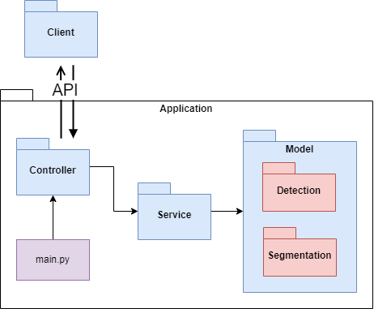

# Abnormal Clods Detection and Segmentation on Video

---

### Author

Eduard Khusnutdinov, a 3rd grade student at Tomsk State University.

---

## App structure

## CLI:

Train model:

    python cli.py train --dataset=<dataset path>

Evaluate model:

    python cli.py evaluate --dataset=<dataset path>

Run real-time demo with provided image or video file:

    python cli.py demo --file=<file path>

## API

Basic information (creator info, metrics, docker build datetime):

    GET /api/info

---

Open page for uploading your video or picture:

    GET /api/index

After upload, you'll be redirected to **/api/demo/<file name>**

---

Page where you can upload your file to run demo:

    GET /api/index

---

Page with real-time demo on your file:

    GET /api/demo/<file name>

## Technologies

- Python
- PyTorch Lightning
- OpenCV
- Flask

